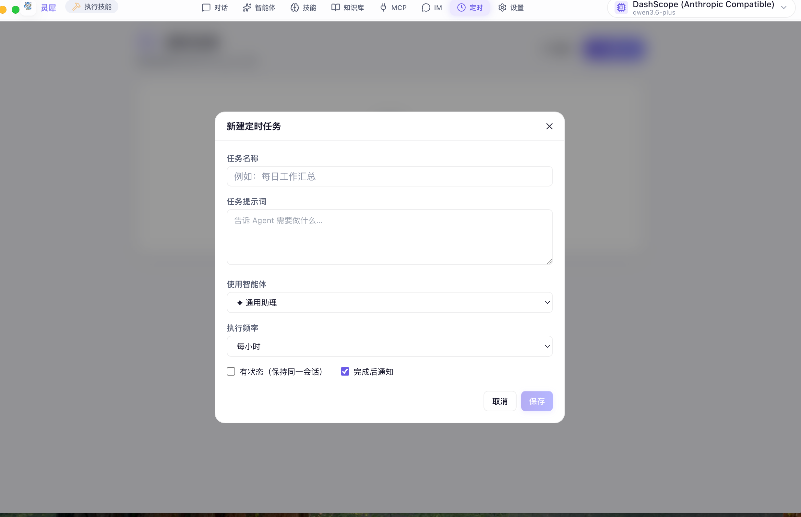

<p align="center">
  
</p>

<h1 align="center">Lingxi AI Agent</h1>

<p align="center">
  <strong>A local-first, composable, extensible desktop AI Agent workspace.</strong>
</p>

<p align="center">
  <a href="README.md">中文</a> ·
  <a href="#-overview">Overview</a> ·
  <a href="#-highlights">Highlights</a> ·
  <a href="#-design-philosophy">Design</a> ·
  <a href="#-screenshots">Screenshots</a> ·
  <a href="#-quick-start">Quick Start</a> ·
  <a href="#-license">License</a>
</p>

---

## 📌 Overview

**Lingxi AI Agent** is a desktop AI Agent workspace for personal productivity and business workflows. It is built with Electron, React, Go, SQLite, and a local AI engine / routing layer that connects to multiple model providers.

Lingxi is more than a chat UI. It provides a complete local AI workspace:

- General chat, search, content generation, and task execution;
- Agent Factory for building scenario-specific agents;
- Multi-provider and multi-model endpoint management;
- Skills, knowledge bases, MCP tools, and IM integrations;
- Local storage for sessions, profiles, knowledge, usage, and configuration.

<p align="center">
  
</p>

---

## ✨ Highlights

### 1. Agent Factory & Template Marketplace

Lingxi includes an **Agent Factory** that lets users create dedicated agents for specific workflows such as finance reconciliation, slide generation, customer support, code review, operation analysis, and more.

**Template Marketplace**: 17 built-in templates across 4 categories (Business & Office / Tech & Dev / Content & Creative / Lifestyle & Productivity). Create a specialized agent with one click.

Each agent can define:

- Name, avatar, and description;
- Role / system prompt;
- Preferred model profile;
- Allowed skills;
- Allowed knowledge bases;
- Allowed MCP servers;
- Temperature and max tokens tuning;
- Dedicated conversation space and message management.

A session is bound to one agent from creation to completion. The agent cannot be changed mid-session, which keeps context and role behavior consistent.

### 2. Multi-model and Multi-provider Support

Lingxi supports Anthropic-native endpoints and OpenAI-compatible providers, including Anthropic, Qwen / DashScope, DeepSeek, Doubao, GLM, Kimi, Gemini, OpenRouter, Groq, SiliconFlow, Ollama, OpenAI Official, and custom endpoints.

OpenAI-compatible providers are routed through a local bridge layer that translates protocols while preserving streaming, tool calls, usage tracking, and reasoning display when available.

### 3. Streaming Chat, Reasoning, and Enhanced Interaction

Lingxi supports real-time WebSocket streaming:

- Token-by-token response rendering;
- Collapsible reasoning / thinking blocks;
- Tool and skill invocation cards;
- Per-message model, token, latency, and cost display;
- Expandable tool-call details including type, status, input summary, and duration;
- **Code block syntax highlighting** + one-click copy;
- **Message copy** button;
- **Full-text message search** (`Cmd + K`);
- **Export conversation to Markdown**;
- **Slash commands** (`/` to invoke 12 quick actions: translate, summarize, write code, review, etc.);
- **Virtual scroll** optimization (auto-enabled when 100+ messages);
- **Message edit / resend**: hover over a user message to reveal an edit button; modify inline and resend — the AI regenerates from that point;
- **Message feedback**: thumbs up / thumbs down on AI replies, persisted to the local database;
- **Knowledge base RAG citations**: inline `[1]` `[2]` superscript markers in AI responses, hover to see source details, collapsible citation list at the bottom of each message.

For providers that expose `reasoning_content` or `reasoning`, Lingxi translates the stream into visible thinking blocks in the UI.

### 4. Two-stage Planning Mode

When facing complex tasks (e.g., "build me an e-commerce system"), Lingxi first asks the user whether to go with a quick answer or enter planning mode. In planning mode, the AI structures multiple decision dimensions (tech stack, feature scope, deployment, database, etc.) as an interactive wizard with progress tracking, step-by-step selection, and final confirmation before execution.

### 5. Skills, Knowledge Base, and MCP

Lingxi offers multiple ways to extend agent capabilities:

- **Skills**: import, AI-generate, ZIP upload, or install from **Smithery marketplace** (search, preview, one-click install);
- **Knowledge Base**: upload local documents (`.md` `.txt` `.csv` `.tsv` `.json` `.pdf` `.docx`) for context-aware answers with **RAG citation visualization**;
- **MCP**: configure stdio / SSE / HTTP MCP servers;
- **Transparency**: see which tools or skills were used during a conversation.

### 6. Scheduled Tasks

Set up **periodic, automated agent tasks**:

- **Flexible frequency**: every N minutes / hours, daily / weekly / monthly at fixed times, or custom Cron expressions;
- **Stateful / stateless mode**: stateful mode keeps the agent in the same session so it can remember previous runs; stateless creates a new session each time;
- **Desktop notifications**: receive a notification when a task completes;
- **Run history**: view status, duration, and summary of each run; click to jump to the full session;
- **Manual trigger**: run any scheduled task on demand.

### 7. IM Integrations

Lingxi can connect to enterprise messaging platforms such as WeCom, DingTalk, and Feishu (Lark), enabling automated replies, internal Q&A, notifications, and workflow automation.

### 8. Local-first Security

- Sessions and messages are stored in local SQLite;
- API keys are encrypted using macOS `safeStorage`;
- Plaintext keys only exist in runtime memory;
- Frontend, backend, and bridge communicate over localhost;
- No telemetry or tracking is included.

---

## 🧭 Design Philosophy

### Local First

Lingxi is a desktop application first. It keeps your data, configuration, conversations, and credentials on your machine whenever possible.

### Composable Agents

Real-world AI usage is not just generic chat. A finance reconciliation agent, a slide-generation agent, a support agent, and a code-review agent all need different roles, models, knowledge, and tools.

Lingxi models an agent as a composable unit:

```text
Agent = Role + Model Profile + Skills + Knowledge Bases + MCP + Conversation Space
```

### Workflow-oriented

Lingxi focuses on getting work done:

- Answer directly when possible;
- Use local files, knowledge, web access, or tools when needed;
- Turn repeatable capabilities into skills or agents;
- Expose agents through IM integrations for team workflows.

### Transparent and Controllable

Tool-using agents can easily become black boxes. Lingxi surfaces tool and skill usage in the UI so users can see what happened.

### Experience Matters

The UI uses an aurora gradient background, glassmorphism, gradient buttons, modern cards, readable message bubbles, charts, and collapsible panels to make complex capabilities approachable. **6 themes** are available (Light / Dark / Midnight / Cyber / Aurora / Cosmos), with smooth page-transition animations.

---

## 🖼 Screenshots

### Home Workspace

The desktop workspace layout: sidebar for navigation and sessions, main area for chat and content, top bar for model, routing status, and quick actions.

<p align="center"></p>

### General Chat

Streaming output, Markdown rendering, collapsible thinking blocks, image pasting, knowledge base toggle, usage stats, and thumbs up/down feedback buttons on every AI reply.

<p align="center"></p>

### Agent Conversation

Each agent has its own session space and role. The screenshot shows a DevOps Expert agent demonstrating its domain capabilities.

<p align="center"></p>

### Planning Mode — Two-stage Interaction

For complex tasks (e.g., "build me an e-commerce system"), the AI first offers a choice between quick answer and planning mode.

<p align="center"></p>

Inside planning mode, the AI presents each decision dimension as an interactive wizard card (tech stack, feature scope, deployment, etc.) with progress tracking.

<p align="center"></p>

### Agent Factory

Create, edit, and manage agents for different business scenarios. 17 built-in templates across 4 categories available.

<p align="center"></p>

### Agent Configuration

Bind a model, skills, MCP servers, and knowledge bases to form a specialized capability set for each agent.

<p align="center"></p>

### Agent Role Settings

Define an agent's identity, responsibilities, tone, boundaries, and domain expertise through role settings.

<p align="center"></p>

### Agent PPT Creation Scenario

An agent autonomously invokes skills to complete complex creative tasks. The screenshot shows a "Content Creator" agent reading skill docs, checking the environment, and generating a 10-page PPT with multiple thinking and tool-call steps.

<p align="center"></p>

### Model Endpoint Management

Add multiple providers, models, endpoints, and API keys. Test connectivity and activate profiles.

<p align="center"></p>

### LLM Routing

Local routing layer enables OpenAI-compatible providers to work seamlessly within the unified desktop experience.

<p align="center"></p>

### MCP Management

Configure stdio / SSE / HTTP MCP servers to extend agents with external tool capabilities.

<p align="center"></p>

### Skill Management & Marketplace

Skills can be locally imported, AI-generated, ZIP-uploaded, or installed from the Smithery marketplace. Search, preview details, and install verified skills with one click.

<p align="center"></p>

### Knowledge Base

Upload local documents (`.md` `.txt` `.csv` `.tsv` `.json` `.pdf` `.docx`). The agent retrieves relevant knowledge before answering, with inline citation badges and collapsible source cards in responses.

<p align="center"></p>

### Scheduled Tasks

Create periodic agent tasks: set a name, prompt, frequency (hourly / daily / custom Cron), choose stateful mode, and enable desktop notifications on completion.

<p align="center"></p>

### IM Integration

Connect WeCom, DingTalk, or Feishu to bring agent capabilities into team message streams.

<p align="center"></p>

### Usage and Billing

Track tokens, cost, and requests by time, model, and session. Set daily / monthly budget caps with automatic alerts.

<p align="center"></p>

---

## 🏗 Architecture

```text
┌────────────────────────────────────────────────────────────┐
│                       Electron Shell                       │
│  ┌────────────┐   ┌────────────┐   ┌─────────────────────┐ │
│  │ main.js    │   │ preload.js │   │ React Frontend      │ │
│  │ processes  │   │ IPC Bridge │   │ UI / State / WS     │ │
│  └─────┬──────┘   └─────┬──────┘   └──────────┬──────────┘ │
│        │                └──── REST + WebSocket┘            │
│        ▼                                                   │
│  ┌──────────────────────────────────────────────────────┐  │
│  │                 Go Backend (Gin + SQLite)             │  │
│  │ Sessions / Messages / Agents / MCP / Skills / KB      │  │
│  │ Providers / Usage / IM Connectors / WebSocket Hub     │  │
│  └───────────────┬──────────────────────────────────────┘  │
│                  ▼                                         │
│         Local AI Engine / Local Bridge / Model Providers   │
└────────────────────────────────────────────────────────────┘
```

| Layer | Tech Stack |
|---|---|
| Desktop Shell | Electron 36 |
| Frontend | React 19, Vite 8, Tailwind CSS, Zustand, Framer Motion, Recharts |
| Backend | Go 1.24, Gin, Gorilla WebSocket, SQLite |
| AI Engine | Claude CLI / local wrapper |
| Routing Layer | LiteLLM Bridge / llm-bridge |
| Data | Local SQLite and filesystem storage |

---

## 🚀 Quick Start

### Prerequisites

| Dependency | Recommended Version | Notes |
|---|---:|---|
| macOS | Apple Silicon arm64 | Current packaging target |
| Node.js | ≥ 20.19 or ≥ 22.12 | Required by Vite 8 |
| Go | ≥ 1.24 | Backend compilation |
| Claude CLI | latest | Local AI engine dependency |

### 1. Clone

```bash
git clone https://github.com/MT-xjr2/lingxi-agent.git
cd lingxi-agent
```

### 2. Configure credentials

```bash
cp ai-config/auth.json.example ai-config/auth.json
```

Edit `ai-config/auth.json`:

```json
{
  "ANTHROPIC_AUTH_TOKEN": "sk-your-api-key-here",
  "ANTHROPIC_BASE_URL": "https://api.anthropic.com",
  "ANTHROPIC_MODEL": "claude-opus-4-5"
}
```

You can also configure encrypted API keys inside the app via **Settings → Models & Endpoints**.

### 3. Build the desktop app

```bash
chmod +x build-desktop.sh
./build-desktop.sh
```

The packaged app will be generated at:

```bash
dist-electron/mac-arm64/灵犀.app
```

### 4. Launch

```bash
open dist-electron/mac-arm64/灵犀.app
```

If macOS blocks the unsigned build:

```bash
xattr -cr dist-electron/mac-arm64/灵犀.app
open dist-electron/mac-arm64/灵犀.app
```

---

## 🧑‍💻 Development

```bash
# Terminal 1: build frontend assets
cd frontend-desktop
npm install
npm run build
```

```bash
# Terminal 2: run backend
cd backend-desktop
go run .
```

```bash
# Terminal 3: run Electron
cd electron
npm install
npm start
```

> The Electron runtime injects environment variables such as `HOME`, `KB_PATH`, `SKILLS_PATH`, and `UPLOADS_PATH`. For the most complete local experience, start through Electron.

---

## ⚙️ Configuration

### Models and Endpoints

Open **Settings → Models & Endpoints** to create an API profile, select provider protocol, fill endpoint / model / API key, test connectivity, and activate it.

### Agent Factory

Open **Agents → New Agent** to configure basic info, role setting, model, skills, MCP servers, and knowledge bases.

### MCP

MCP management supports `stdio`, `sse`, and `http`, including headers and env configuration.

### Data Location

On macOS, app data is usually stored at:

```text
~/Library/Application Support/灵犀/
```

Common files and directories:

```text
smart-agent.db       # SQLite database
ai-home/             # isolated AI engine HOME
knowledge/           # knowledge base files
uploads/             # pasted / uploaded images
bridge-home/         # bridge runtime data
```

---

## ⌨️ Keyboard Shortcuts

| Action | Shortcut |
|---|---|
| Send message | `Enter` |
| Insert newline | `Shift + Enter` |
| Invoke slash commands | Type `/` |
| Full-text message search | `⌘ + K` |
| Paste image and attach | `⌘ + V` |
| Rename session | Double-click session title |
| Stop generation | Click the stop button |
| Copy / Paste / Select all | `⌘ + C` / `⌘ + V` / `⌘ + A` |
| Open DevTools | `⌥ + ⌘ + I` |
| Reload | `⌘ + R` |
| Quit | `⌘ + Q` |

---

## 📁 Project Structure

```text
lingxi-agent/
├── backend-desktop/       # Go backend: APIs, WebSocket, SQLite, agent runtime
├── frontend-desktop/      # React frontend: chat, agents, settings, MCP, KB
├── electron/              # Electron main process, preload, packaging, resources
├── ai-config/             # AI engine configuration templates
├── images/                # README screenshots
├── build-desktop.sh       # one-click build script
├── logo.jpg               # project logo
├── LICENSE                # MIT License
├── README.md              # Chinese documentation
└── README-EN.md           # English documentation
```

---

## 🧩 Use Cases

- Personal desktop AI assistant;
- Internal knowledge-base Q&A;
- Dedicated agents for finance, operations, support, and engineering;
- Slide, report, and content generation;
- IM-based automation;
- Multi-model cost and quality evaluation;
- Local toolchain and MCP integration.

---

## ❓ FAQ

### Build fails with Vite Node version error

Vite 8 requires Node.js ≥ 20.19 or ≥ 22.12:

```bash
brew install node
node --version
```

### macOS says the app is damaged or unidentified

For unsigned local builds:

```bash
xattr -cr /Applications/灵犀.app
open /Applications/灵犀.app
```

### How do I fully reset the app?

```bash
pkill -x "灵犀" 2>/dev/null
rm -rf "/Applications/灵犀.app"
rm -rf "$HOME/Library/Application Support/灵犀"
```

### Where are pasted images stored?

Pasted or uploaded images are stored in the app data directory under `uploads/` and served locally via `/api/uploads/*`.

### Why can't a session switch agents?

An agent defines role, model, knowledge, and tool permissions. Switching mid-session would conflict with previous context, so each session is locked to one agent from start to finish.

---

## 🗺 Roadmap

**Completed ✅**
- Code block syntax highlighting + copy;
- Message one-click copy;
- Full-text message search (Cmd+K);
- Export conversation to Markdown;
- Slash command shortcuts (12 commands);
- Virtual scroll for long conversations;
- 6 themes (Light / Dark / Midnight / Cyber / Aurora / Cosmos);
- Agent template marketplace (17 templates);
- Knowledge base: PDF / DOCX support;
- Budget alerts;
- Session rename + modal confirmation;
- Page transition animations;
- Message edit / resend;
- Message feedback (thumbs up/down);
- Knowledge base RAG citation visualization;
- Scheduled tasks (periodic / manual / stateful / desktop notifications);
- Two-stage planning mode (interactive wizard);
- Smithery skill marketplace integration;
- IM integration (WeCom / DingTalk / Feishu).

**Planned 📋**
- Multi-turn conversation branching;
- Agent import/export JSON;
- Agent usage analytics;
- Multi-window / tabs;
- Plugin marketplace frontend;
- More granular agent permission controls;
- Per-agent MCP isolation;
- More IM platforms;
- Multi-device sync options.

---

## 📜 License

This project is licensed under the **MIT License**. See [LICENSE](LICENSE) for details.

