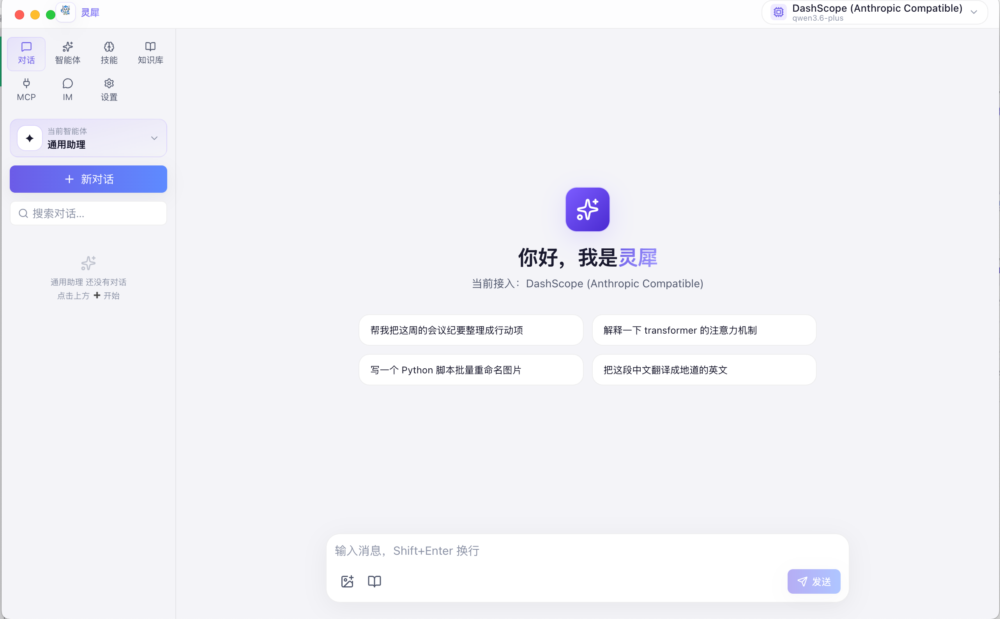
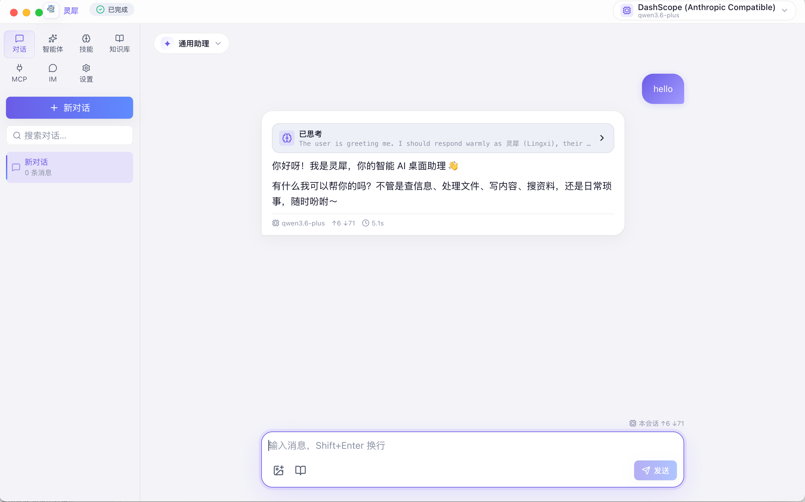
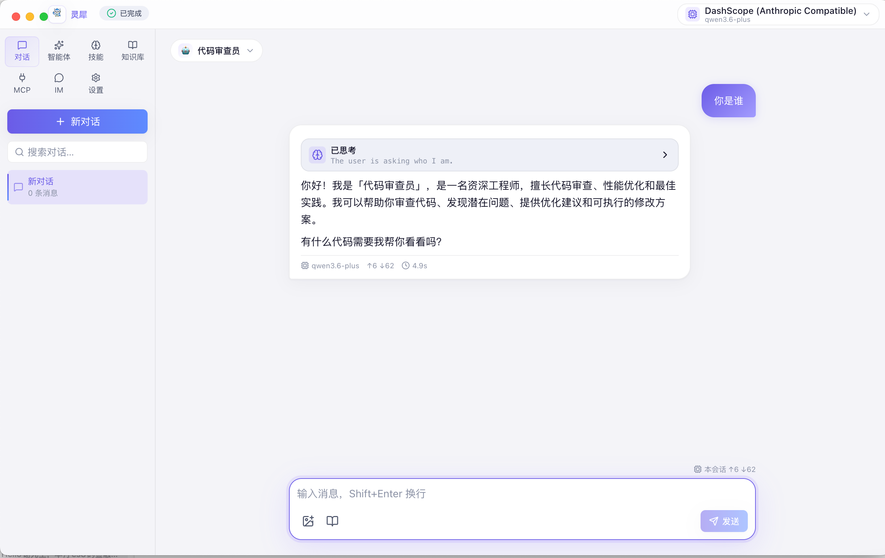
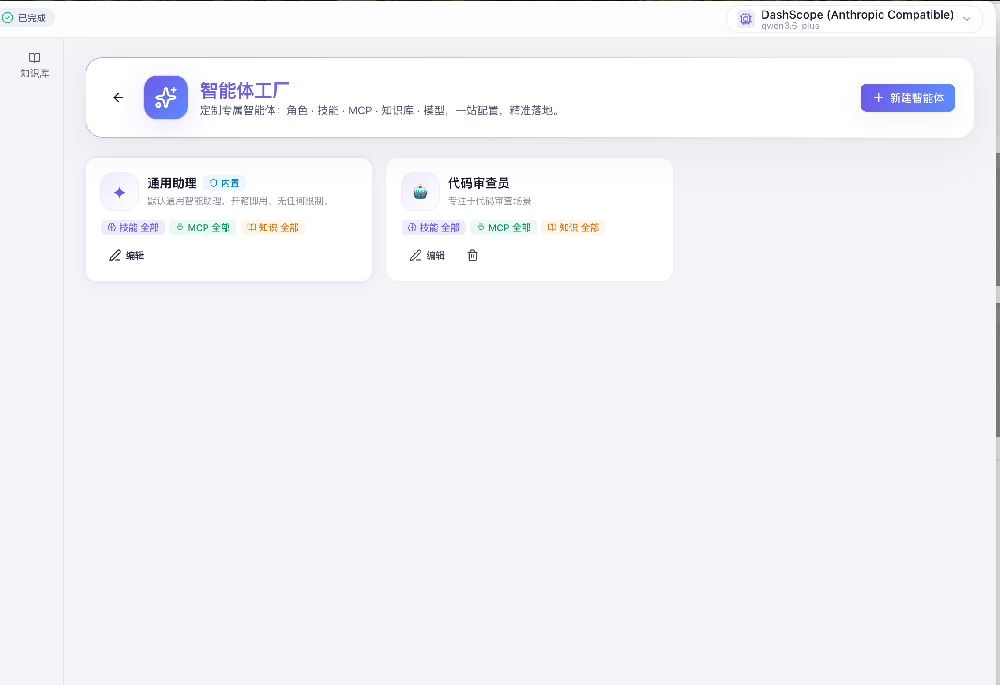
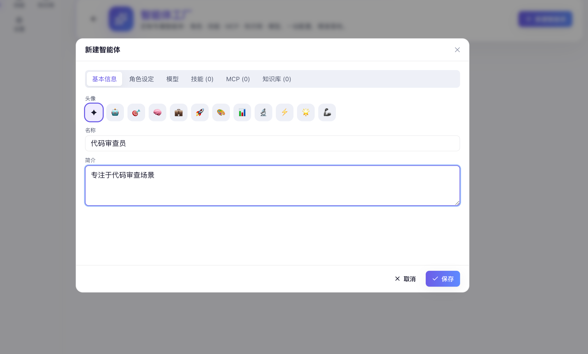
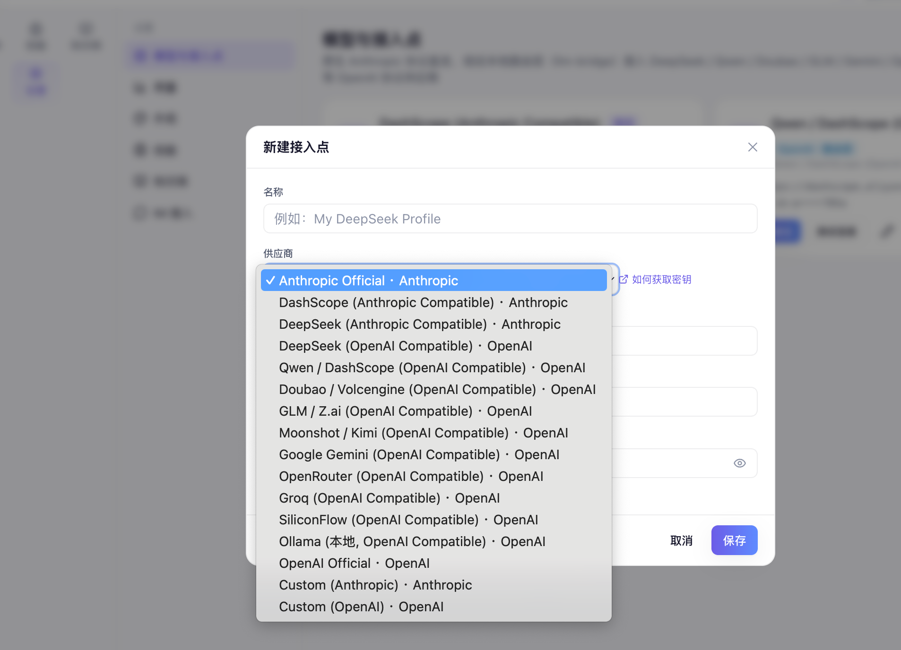
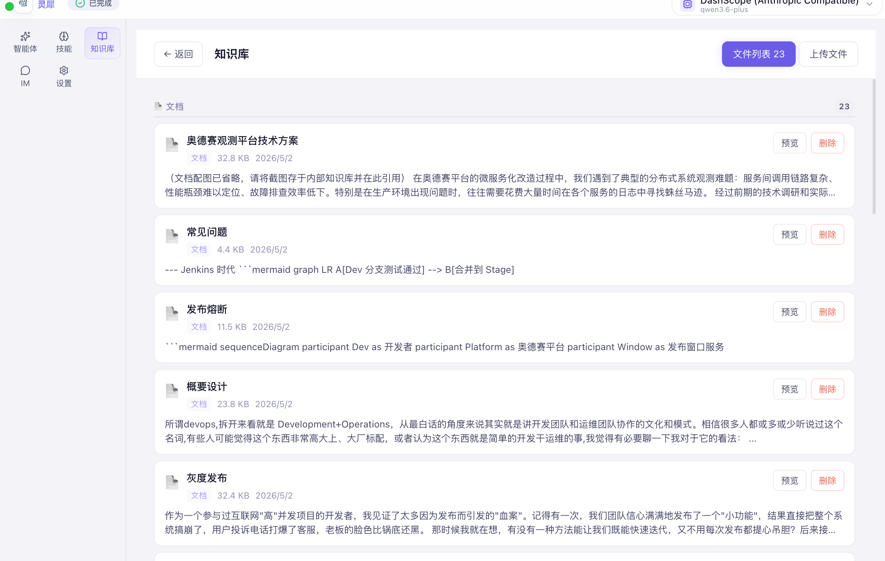

<p align="center">
  
</p>

<h1 align="center">灵犀 AI Agent</h1>

<p align="center">
  <strong>一个本地优先、可组合、可扩展的桌面 AI Agent 工作台。</strong>
</p>

<p align="center">
  <a href="README-EN.md">English</a> ·
  <a href="#-项目简介">项目简介</a> ·
  <a href="#-核心亮点">核心亮点</a> ·
  <a href="#-设计理念">设计理念</a> ·
  <a href="#-功能展示">功能展示</a> ·
  <a href="#-快速开始">快速开始</a> ·
  <a href="#-开源协议">License</a>
</p>

---

## 📌 项目简介

**灵犀 AI Agent** 是一个面向个人与企业工作流的桌面端 AI Agent 系统。它以 Electron 作为桌面容器、React 作为前端界面、Go 作为本地后端服务，并通过本地 AI 引擎与多模型接入层连接不同模型供应商。

灵犀不是一个单纯的聊天窗口，而是一个完整的 **AI 工作台**：

- 可以像普通助手一样对话、搜索、整理、生成内容；
- 可以通过 **智能体工厂** 创建面向不同业务场景的专属 Agent；
- 可以接入不同模型与供应商，按任务选择合适模型；
- 可以通过技能、知识库、MCP 工具和 IM 接入，把 AI 放进真实工作流程；
- 会话、配置、知识库、用量等核心数据默认保存在本机。

<p align="center">
  
</p>

---

## ✨ 核心亮点

### 1. 智能体工厂：为每个场景定制专属 Agent

灵犀内置 **智能体工厂**。用户可以创建面向特定业务场景的智能体，例如财务对账、PPT 创作、客服回复、代码审查、运营分析等。

每个智能体可以独立配置：

- 名称、头像、描述；
- 角色设定 / System Prompt；
- 使用的模型与接入点；
- 允许使用的技能；
- 可访问的知识库；
- 可使用的 MCP 服务；
- 专属会话入口与独立消息管理。

一个会话从创建开始就绑定唯一智能体，后续不会被切换，避免角色设定与历史上下文混乱。

### 2. 多模型与多接入点管理

灵犀支持 Anthropic 协议与 OpenAI 兼容协议供应商。你可以在应用内维护多个模型接入点，并按需切换。

典型支持：Anthropic、DashScope / Qwen、DeepSeek、Doubao、GLM、Moonshot / Kimi、Gemini、OpenRouter、Groq、SiliconFlow、Ollama、本地或自定义 OpenAI / Anthropic 兼容端点。

OpenAI 兼容供应商会通过本地 bridge 路由层转换协议，让桌面 Agent 保持工具调用、流式输出、用量统计和思考过程展示等能力。

### 3. 实时流式对话与思考过程展示

灵犀支持 WebSocket 流式对话：

- 逐字符输出；
- 思考过程折叠展示；
- 工具 / 技能调用过程展示；
- 每条消息展示模型、Token、耗时和费用；
- 工具调用详情可展开查看，包括工具类型、输入摘要、状态和耗时。

对于支持 `reasoning_content` / `reasoning` 的 OpenAI 兼容模型，灵犀会在本地 bridge 层转换为可展示的思考块。

### 4. 技能、知识库与 MCP 扩展

灵犀提供多种扩展方式：

- **技能管理**：导入、生成、安装和卸载本地技能；
- **知识库管理**：上传文档，作为对话时的本地上下文来源；
- **MCP 管理**：配置 stdio / SSE / HTTP 类型 MCP 服务，让 Agent 使用外部工具；
- **技能透明化**：前台可以看到本次对话使用了哪些技能或工具。

### 5. IM 集成与业务自动化

灵犀可以接入企业微信、钉钉等 IM 平台，用于自动回复、消息处理、内部问答、通知和流程自动化等场景。

### 6. 本地优先与安全设计

- 会话与消息保存在本地 SQLite；
- API Key 通过 macOS `safeStorage` 加密；
- 明文密钥只存在于运行时内存中；
- 前端、后端和路由层通信均在 localhost；
- 不包含外部遥测或追踪逻辑。

---

## 🧭 设计理念

### 本地优先

灵犀首先是一个桌面应用，而不是云端平台。它尽量把数据、配置、会话和密钥保存在本机，让用户对自己的工作数据有更强控制权。

### 可组合 Agent

现实中的 AI 使用场景并不只有“通用聊天”。一个财务对账 Agent、一个 PPT 创作 Agent、一个客服 Agent、一个代码审查 Agent 所需要的角色、模型、知识库和工具完全不同。

因此灵犀将 Agent 设计成可组合对象：

```text
Agent = 角色设定 + 模型接入点 + 技能 + 知识库 + MCP + 会话空间
```

用户可以围绕真实业务场景创建多个智能体，而不是在一个通用对话框里反复提示模型“你现在扮演谁”。

### 面向工作流，而不是只面向问答

灵犀强调“把事情做完”：

- 能直接回答的问题，直接回答；
- 需要本地文件、知识库、网页或工具时，可以调用工具；
- 需要长期复用的能力，可以沉淀为技能或智能体；
- 需要团队入口时，可以接入 IM。

### 透明可控

AI Agent 调用工具时容易变成黑盒。灵犀会在界面中展示工具 / 技能调用的状态、耗时和摘要，让用户知道 AI 做了什么。

### 体验优先

灵犀采用桌面端沉浸式 UI：极光渐变背景、毛玻璃顶栏、渐变按钮、消息气泡、技能卡片、图表和可折叠详情面板，让复杂能力以清晰、现代、轻量的方式呈现。

---

## 🖼 功能展示

### 首页与整体工作台

灵犀采用桌面工作台式布局：左侧为导航与会话空间，中间为主功能区，顶部展示模型、路由层和运行状态。

<p align="center"></p>

### 普通对话

支持流式输出、Markdown 渲染、图片粘贴、知识库开关、用量统计与停止生成。

<p align="center"></p>

### 智能体交互

每个智能体拥有独立的会话空间。会话创建后锁定智能体，避免角色和上下文被中途切换。

<p align="center"></p>

### 智能体工厂

在智能体工厂中，可以创建、编辑和管理不同业务场景的 Agent。

<p align="center"></p>

### 智能体配置

一个智能体可以绑定模型、技能、MCP 和知识库，形成面向特定场景的专业能力组合。

<p align="center"></p>

### 角色设定

通过角色设定，用户可以明确智能体的身份、职责、语气、边界和专业领域。

<p align="center"></p>

### Agent PPT 创作场景

智能体可以被配置成面向创作、汇报、运营、财务、研发等具体场景的工作助手。

<p align="center"></p>

### 模型与接入点管理

在接入点管理中，可以添加不同供应商、模型、Endpoint 和密钥，并进行激活与连通性测试。

<p align="center"></p>

### 多模型路由与 LLM 能力

灵犀通过本地路由层支持 OpenAI 兼容供应商，让不同模型可以在统一桌面体验中工作。

<p align="center"></p>

### MCP 管理

支持配置 stdio / SSE / HTTP 类型 MCP 服务，让智能体获得更多外部工具能力。

<p align="center"></p>

### 技能管理

技能可以导入、生成、安装、卸载，并在对话中被智能体按需使用。

<p align="center"></p>

### 知识库管理

上传本地文档后，智能体可以在回答前检索相关知识，减少幻觉并提高场景准确性。

<p align="center"></p>

### IM 集成

支持企业微信、钉钉等 IM 连接器，把智能体能力接入团队消息流。

<p align="center"></p>

### 用量与计费

按时间、模型和会话统计 Token、费用与请求情况，方便评估模型成本。

<p align="center"></p>

---

## 🏗 系统架构

```text
┌────────────────────────────────────────────────────────────┐
│                       Electron 桌面壳                       │
│  ┌────────────┐   ┌────────────┐   ┌─────────────────────┐ │
│  │ main.js    │   │ preload.js │   │ React Frontend      │ │
│  │ 窗口/进程   │   │ IPC Bridge │   │ UI / 状态 / WS       │ │
│  └─────┬──────┘   └─────┬──────┘   └──────────┬──────────┘ │
│        │                └──── REST + WebSocket┘            │
│        ▼                                                   │
│  ┌──────────────────────────────────────────────────────┐  │
│  │                 Go Backend (Gin + SQLite)             │  │
│  │ Sessions / Messages / Agents / MCP / Skills / KB      │  │
│  │ Providers / Usage / IM Connectors / WebSocket Hub     │  │
│  └───────────────┬──────────────────────────────────────┘  │
│                  ▼                                         │
│         本地 AI 引擎 / 本地 Bridge / 多模型供应商            │
└────────────────────────────────────────────────────────────┘
```

| 层级 | 技术 |
|---|---|
| 桌面壳 | Electron 36 |
| 前端 | React 19、Vite 8、Tailwind CSS、Zustand、Framer Motion、Recharts |
| 后端 | Go 1.24、Gin、Gorilla WebSocket、SQLite |
| AI 引擎 | Claude CLI / 本地封装脚本 |
| 路由层 | LiteLLM Bridge / llm-bridge，本地 OpenAI ↔ Anthropic 协议转换 |
| 数据 | 本地 SQLite + 文件系统目录 |

---

## 🚀 快速开始

### 环境要求

| 依赖 | 建议版本 | 说明 |
|---|---:|---|
| macOS | Apple Silicon arm64 | 当前打包目标 |
| Node.js | ≥ 20.19 或 ≥ 22.12 | Vite 8 要求 |
| Go | ≥ 1.24 | 编译本地后端 |
| Claude CLI | 最新版 | 本地 AI 引擎依赖 |

### 1. 克隆项目

```bash
git clone https://github.com/MT-xjr2/lingxi-agent.git
cd lingxi-agent
```

### 2. 配置凭据

```bash
cp ai-config/auth.json.example ai-config/auth.json
```

编辑 `ai-config/auth.json`：

```json
{
  "ANTHROPIC_AUTH_TOKEN": "sk-your-api-key-here",
  "ANTHROPIC_BASE_URL": "https://api.anthropic.com",
  "ANTHROPIC_MODEL": "claude-opus-4-5"
}
```

也可以启动应用后，在 **设置 → 模型与接入点** 中配置和加密保存 API Key。

### 3. 一键构建桌面应用

```bash
chmod +x build-desktop.sh
./build-desktop.sh
```

构建产物位于：

```bash
dist-electron/mac-arm64/灵犀.app
```

### 4. 启动

```bash
open dist-electron/mac-arm64/灵犀.app
```

如果 macOS 提示未验证开发者，可执行：

```bash
xattr -cr dist-electron/mac-arm64/灵犀.app
open dist-electron/mac-arm64/灵犀.app
```

---

## 🧑‍💻 开发模式

```bash
# 终端 1：构建前端静态资源
cd frontend-desktop
npm install
npm run build
```

```bash
# 终端 2：启动 Go 后端
cd backend-desktop
go run .
```

```bash
# 终端 3：启动 Electron
cd electron
npm install
npm start
```

> 注意：项目的桌面运行时会通过 Electron 注入 `HOME`、`KB_PATH`、`SKILLS_PATH`、`UPLOADS_PATH` 等环境变量。开发模式下如需完整体验，建议优先通过 Electron 启动。

---

## ⚙️ 配置说明

### 模型与接入点

进入 **设置 → 模型与接入点**：新建接入点、选择协议、填写 endpoint / model / API Key，测试连通性后激活。

### 智能体工厂

进入 **智能体 → 新建智能体**，可配置基本信息、角色设定、模型、技能、MCP 和知识库。

### MCP

MCP 管理支持 `stdio`、`sse`、`http` 三种类型，并支持 headers / env 配置。

### 数据位置

macOS 下通常位于：

```text
~/Library/Application Support/灵犀/
```

常见子目录：

```text
smart-agent.db       # SQLite 数据库
ai-home/             # 隔离 AI 引擎 HOME
knowledge/           # 知识库文件
uploads/             # 用户粘贴/上传图片
bridge-home/         # bridge 运行数据
```

---

## ⌨️ 快捷键

| 操作 | 快捷键 |
|---|---|
| 发送消息 | `Enter` |
| 输入框换行 | `Shift + Enter` |
| 粘贴图片并自动附加 | `⌘ + V` |
| 停止生成 | 点击输入框右侧停止按钮 |
| 复制 / 粘贴 / 全选 | `⌘ + C` / `⌘ + V` / `⌘ + A` |
| 打开 DevTools | `⌥ + ⌘ + I` |
| 重载窗口 | `⌘ + R` |
| 退出应用 | `⌘ + Q` |

---

## 📁 项目结构

```text
lingxi-agent/
├── backend-desktop/       # Go 后端：API、WebSocket、SQLite、Agent 执行
├── frontend-desktop/      # React 前端：聊天、智能体、设置、MCP、知识库等
├── electron/              # Electron 主进程、preload、打包配置和内置资源
├── ai-config/             # AI 引擎配置模板
├── images/                # README 展示截图
├── build-desktop.sh       # 一键构建脚本
├── logo.jpg               # 项目 Logo
├── LICENSE                # MIT License
├── README.md              # 中文文档
└── README-EN.md           # 英文文档
```

---

## 🧩 适用场景

- 个人桌面 AI 助理；
- 企业内部知识库问答；
- 财务、运营、客服、研发等岗位专属 Agent；
- PPT / 报告 / 文案创作；
- IM 自动回复与流程自动化；
- 多模型成本与效果评估；
- 本地工具链与 MCP 能力集成。

---

## ❓ 常见问题

### 构建时报 Vite Node 版本错误

Vite 8 要求 Node.js ≥ 20.19 或 ≥ 22.12。请升级 Node：

```bash
brew install node
node --version
```

### macOS 提示应用损坏或无法验证

未签名构建可能出现该提示：

```bash
xattr -cr /Applications/灵犀.app
open /Applications/灵犀.app
```

### 如何完全重置应用？

```bash
pkill -x "灵犀" 2>/dev/null
rm -rf "/Applications/灵犀.app"
rm -rf "$HOME/Library/Application Support/灵犀"
```

### 图片粘贴后保存在哪里？

用户粘贴或上传的图片会保存到应用数据目录下的 `uploads/`，并通过本地 `/api/uploads/*` 静态路由展示。

### 为什么一个会话不能切换智能体？

因为智能体的角色、模型、知识库和工具权限会影响整个上下文。允许中途切换会导致历史消息与新角色冲突，因此灵犀采用“一个会话从头到尾绑定一个智能体”的设计。

---

## 🗺 Roadmap

- 更细粒度的智能体权限控制；
- MCP 配置的 per-agent 强制隔离；
- 更多 IM 平台；
- 技能市场 / 技能模板；
- 多端同步方案；
- 更完善的使用成本分析与预算提醒。

---

## 📄 英文文档

English documentation is available here: [README-EN.md](README-EN.md)

---

## 📜 开源协议

本项目采用 **MIT License** 开源协议。详见 [LICENSE](LICENSE)。
